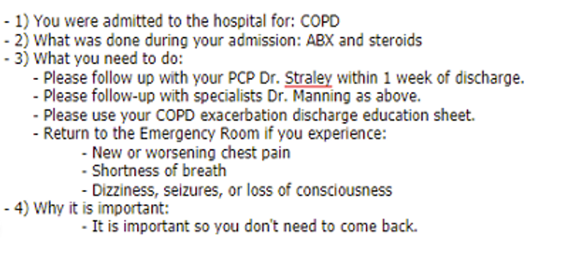
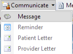
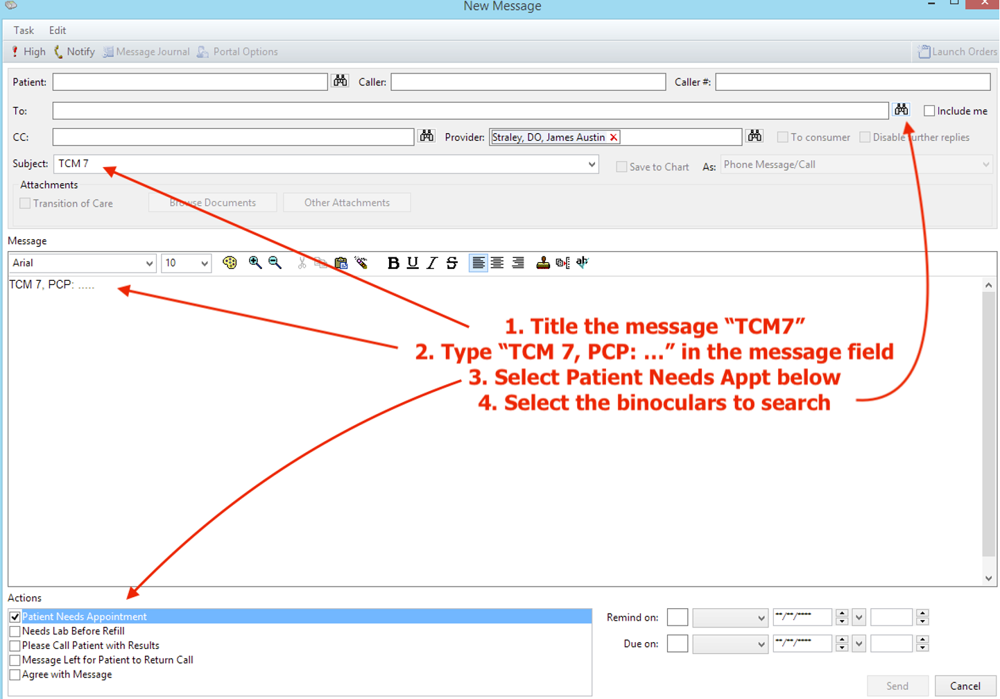
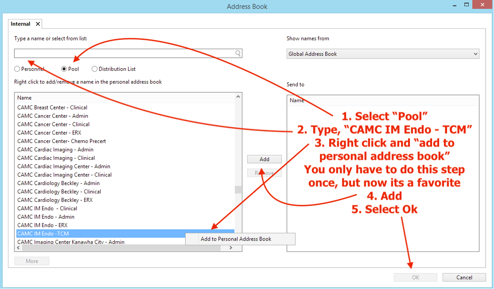
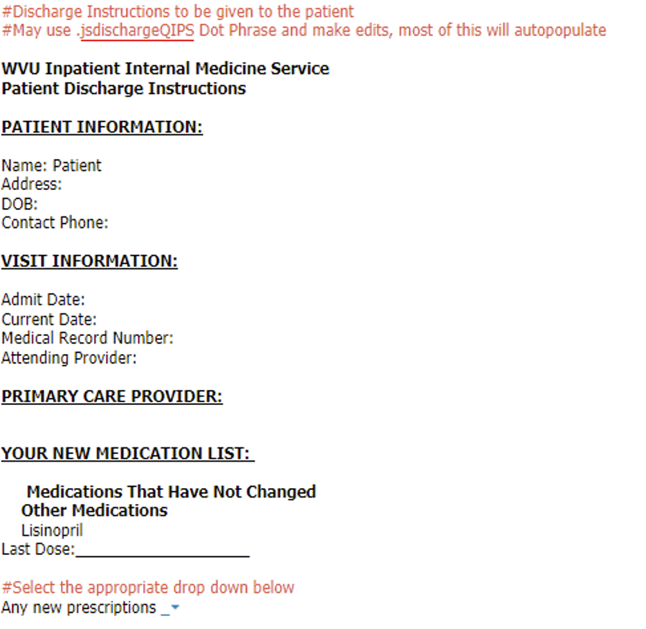
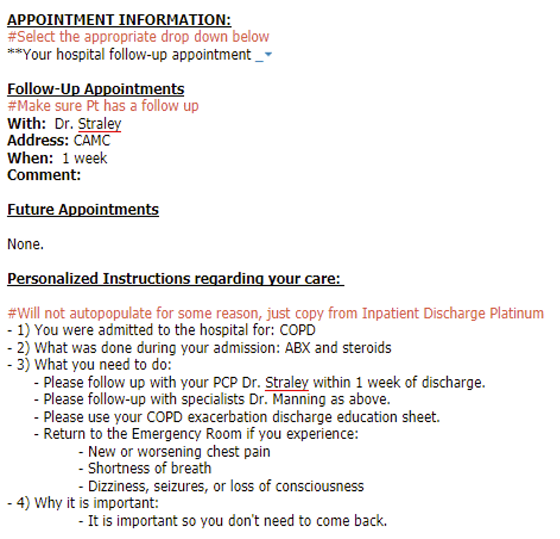
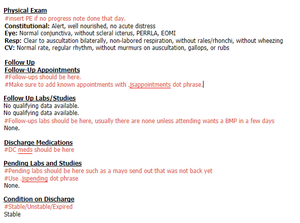

*
<mark>“Drop a lil' knowledge on 'em”</mark>
*

## Medication Reconciliation (Discharge)

- Navigate to the Med Rec as seen in “How to Admit a Patient” 
- With your Senior, complete the Med Rec for discharge
  - This is the main opportunity to stop or change medications for the patient after discharge
    - Once this step is completed, you will see the "check" beside Home Medications as below.

## Patient Instructions/Follow-Ups/Education

- Navigate to the Inpatient Workflow Discharge Platinum and select the “Patient Instructions” 

 

 

- The instructions can be done multiple ways and as long as you communicate to the patient what needs to be done, you can do this as you like. I utilize the Uptodate method to break it down into simple easy to digest steps. I then saved it as a dotphrase .jsdischargeinstructions
  - Just make sure to save this field as it will autopopulate into your Discharge summary
  - Anywhere within the Instructions field, press Ctrl + A, then Ctrl + C 

 

- Make sure to complete the Follow-ups and Patient education on the same page as you go
  - Follow-ups are typically with the patient’s PCP, generally I have them follow up within a few days to 10 days depending on the condition.
    - Option 1) Patient’s PCP is a random person somewhere else
      - It is not required, but encouraged to notify them about their patient needing a follow up
    - Option 2) Patient is established with Dr. Aman, Dr. Hadley, Dr. John, Dr. Durden, or Dr. Griffith
      - You will need to Select “Communicate and Message” at the top of the page to create a new message for their clinic
      - To do so: 

    
     

    
     

    
     

    - Send this message
      - Option 3) Patient is OPCC Resident’s patient
        - Same process as above but will select “MEM Outpatient Care Center – TCM” as the message recipient
      - NOTE: Do not schedule TCM visits if the patient is going to a SNF
  - Patient Education is to be selected based on relevance to their condition
    - Ex. Pt admitted for AECOPD could be given information on signs and symptoms of COPD exacerbation or the ALA’s information on grading their COPD exacerbation severity

## Discharge Instructions

- Prior to generating the Discharge Instructions, make sure the Home Medications, Follow-Up, and Patient Education tabs have the green check mark beside them in the Inpatient Discharge MPage. The Order Profile should still have the red star.
- Now it is time to create the patient’s discharge instructions
  - Type: Discharge Instructions
  - Note Template: Free Text Note
  - Title: “CAMC IM Discharge Instructions” 

    
     

    
     

- Now, at the bottom there will be my generic instructions, delete those and press Ctrl + P
- This should paste the modified instructions from your instructions tab you completed in the previous step.
- Sign and Print this page. You will give this to the patient.

## Discharge Summary

- “Discharge summaries are to be done within 36 hours of discharge or prior to transferring a patient to another facility”
- A discharge summary can replace a progress note for the day
  - Ex. Discharge Mr. Hill at 2pm and complete discharge summary = no need for progress note that day
- Type: Discharge Summary
- Note Template: Inpatient Discharge Summary
- Title: “CAMC IM Discharge Summary”
    1. Dates of Service/Admitting Diagnosis/Primary + Secondary Discharge Diagnosis 
    
     
    2. Procedures/Consults 
    
     
    3. Studies
        - Use the .jsimaging_report dot phrase
            - Note: ECHOs/Vascular Studies are not added in this dotphrase and must be added manually.
            - Try to delete extraneous information if possible
                - Ex.
                    1. **************************************
                    2. CTA w/o Contrast
                    3. MM/DD/YYYY 12:00:00
                    4. IMPRESSION: Bad study
                    5. Electronically Signed by: Reading Physician
                    6. **************************************
    4. Hospital Course
        - Within the hospital course field on your Inpatient Workflow Discharge Platinum or within your inpatient workflow, you can complete the hospital course to auto populate into your discharge summary 
    
     
    5. Physical Exam/ Follow-Up Appointments/ Follow-Up Labs/Studies
    6. Discharge Medications/ Pending Labs and Studies/ Condition on Discharge 
    
     
    7. Patient Instructions/Discharge Disposition/Physician Orders/Signature 
    
     
